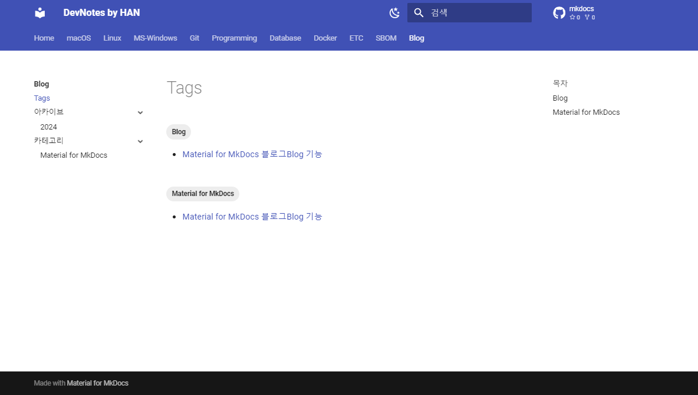

# Material for MkDocs 블로그^Blog^ 기능

Material for MkDocs에 있는 블로그^Blog^ 기능에 대해서 알아보자.
Insider[^1] 버전을 사용하기 위해서는 비용이 발생하기 때문에 특별한 이유가 아니라면 여기에서는 무료로 사용할 수 있는 기능 정도만 사용한 블로그 작성법을 설명한다.

[^1]: <https://squidfunk.github.io/mkdocs-material/insiders/>

<!-- more -->

## 블로그 마크다운 파일 생성

`docs/blog/posts` 폴더 아래에 작성할 블로그에 대한 적당한 이름의 `*.md` 파일을 하나 생성한다.

## 블로그 정보 입력

그리고는 해당 파일의 가장 앞에 블로그에 대한 정보를 기입한다.

```
---
draft: true
date: 2024-06-17
authors:
    - dohan
categories:
    - Material for MkDocs
tags:
    - Material for MkDocs
    - Blog
slug: material-for-mkdocs-blog-writing    
---

# Material for MkDocs 블로그^Blog^ 기능

Material for MkDocs에 있는 블로그^Blog^ 기능에 대해서 알아보자.
Insider[^1] 버전을 사용하기 위해서는 비용이 발생하기 때문에 특별한 이유가 아니라면 여기에서는 무료로 사용할 수 있는 정도까지만 정리해 보고자 한다.

<!-- more -->

`docs/blog/posts` 폴더 아래에 작성할 블로그에 대한 적당한 이름의 `*.md` 파일을 하나 생성한다.
```

예제에 포함된 정보에 대해서 간략히 설명하면 아래와 같다.

- draft
    : 임시 저장 문서 여부.
    `true` 값은 임시 저장 문서, `false` 값은 작성 완료된 문서임
- date
    : 지정된 포맷의 날짜 형식을 입력.
    `YYYY-MM-DD` 형식으로 지정하도록 설정되어 있음
- authors
    : `.authors.yml` 파일에 미리 등록된 저자를 선택함
- categories
    : 블로그의 카테고리 정보를 입력함
- tags
    : 블로그의 태그 정보를 입력함
- slug
    : 블로그의 슬러그^Slug^[^2] 정보를 입력함

[^2]: <https://ivynet.co.kr/what-is-slug/>

## 블로그 화면

블로그 인덱스 화면은 아래와 같이 왼쪽에는 태그, 아카이브, 카테고리를 선택할 수 있는 메뉴가 있다.
가운데에는 최신 블로그부터 보여지는 목록을 확인할 수 있고, 오른쪽에는 목차를 통해 편하게 블로그를 선택할 수 있다.


임의의 블로그를 선택하면, 해당 블로그의 내용을 확인할 수 있다.
블로그 내용 화면의 왼쪽에는 `Index로 돌아가기` 버튼이 위에 있고, 저자에 대한 정보와 메타데이터 항목을 확인할 수 있다.

가운데와 오른쪽에는 Material for MkDocs의 일반 화면과 유사하게 구성된 내용을 볼 수 있다.
다만, 태그^Tag^를 사용한 문서의 경우, 타이틀 위에 입력한 태그를 확인할 수 있도록 되어 있다.


문서 내용의 제일 위에 있는 태그를 선택하면 블로그 태그 화면으로 이동한다.
태그를 입력한 문서들에 대해서 "카테고리"와는 별개로 관련 문서 목록을 확인할 수 있다.



## 블로그 내용 입력

블로그 정보를 입력한 이후부터는 블로그 내용을 입력한다.

블로그 인덱스^Index^에서 전체 내용이 보이도록 할 수도 있지만, 너무 복잡해 보일 수 있기 때문에 이후 내용을 생략하기 위해서는 `<!-- more -->`를 입력한다.
`<!-- more -->` 이후의 내용은 인덱스에서는 보이지 않고, `계속 읽기`를 누르거나 블로그 타이틀을 선택했을 경우에 전체 내용을 확인할 수 있다.

## 저자^Author^ 추가

블로그 저자^Author^를 추가하기 위해서는 `docs/blog/.authors.yml` 파일을 수정해야 한다.

!!! warning
    만약 YAML 파일에 없는 저자를 블로그 문서의 저자로 지정한 경우, 오류가 발생하기 때문에 새로운 저자인 경우에는 꼭 `.authors.yml` 파일에 저자를 추가해야 한다.

`.authors.yml` 파일을 열어보면 샘플과 같이 저자를 작성하면 되는데, `name`, `descrption`, `avatar` 항목을 꼭 채워넣어야 한다.

```{.yaml .no-copy}
authors:
    dohan:
        name: Dohan KWON
        description: SS연구팀 수석연구원
        avatar: https://github.com/dohankwon.png
```