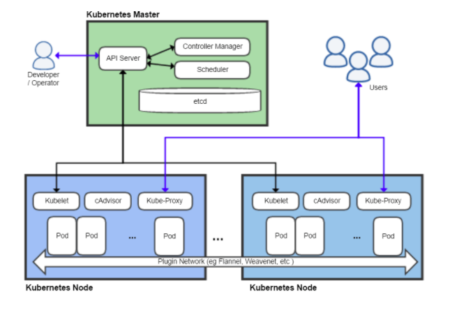

# Kubernetes

<!-- - [Install kubernetes cluster](#install-kubernetes-cluster)
    - [Overview](#overview)
    - [Check list](#check-list)
    - [Kubernetes running ports](#kubernetes-running-ports)
    - [Step 1. Install docker](#step-1-install-docker)
    - [Step 2. Install kubernetes cluster](#step-2-install-kubernetes-cluster)
        - [Step 2.1 Download kubernetes](#step-21-download-kubernetes)
        - [Step 2.2 Configure `cgroup` driver](#step-22-configure-cgroup-driver)
        - [Step 2.3 Copy configuration for kubectl client](#step-23-copy-configuration-for-kubectl-client)
        - [Step 2.4 Join cluster in WORKER NODES](#step-24-join-cluster-in-worker-nodes)
        - [Step 2.5 Apply CNI on MASTER NODE](#step-25-apply-cni-on-master-node)
    - [Step 3. Verify results](#step-3-verify-results)
    - [Run hello world deployment](#run-hello-world-deployment)
    - [Troubleshoot](#troubleshoot)
    - [Debug command](#debug-command)
    - [References:](#references)
- [Install Minikube](#install-minikube)
    - [Online install](#online-install)
    - [Offline Install](#offline-install) -->

## Install kubernetes cluster

This guide provides a tutorial for install kubernetes cluster on 3 virtual machine in local host. Those following configuration will apply for production. You should use [minikube](https://kubernetes.io/docs/tasks/tools/install-minikube/) for developing easily.

### Overview



1.  3 CentOS 7 virtual machines (VMWare or VirtualBox)
2.  2 GB or more of RAM per machine. 2 CPUs or more on the master.
3.  Full network connectivity between all machines in the cluster

### Check list

!!! danger
    By default, RHEL 7.2 uses `xfs` with `ftype=0` while RHEL 7.5 uses `ftype=1`

    If you use overlay or overlay2 as Docker storage driver you should check the following backing filesystems are supported:

    - `ext4` (RHEL 7.1 only)
    - `xfs` (RHEL 7.2 and higher), but only with `d_type=true` enabled. Use `xfs_info` to verify that the `ftype` option is set to `1`. To format an xfs filesystem correctly, use the flag `-n ftype=1`.

- [ ] Make sure you have a MAC unique address using the command `ip link`
- [ ] Make sure the file system is
- [ ] Make sure the time in machine is up-to-date and synchronize between 2 servers

```sh
yum install ntp
ntpdate time.apple.com
```

- [ ] Verify each machine have a unique `product_uuid`

```
sudo cat /sys/class/dmi/id/product_uuid
```

- [ ] Configure dns in `/etc/hosts` file and hostname `hostnamectl set-hostname` for each machine.

```
192.168.233.160 master.local
192.168.233.162 node2.local
192.168.233.161 node1.local
```

- [ ] Disable SELinux by setting value `SELINUX=disabled` in `/etc/selinux/config`
- [ ] Disable permanent swap for kubernetes scheduler optimizes resources. Remove swap partition at boot by commenting swap partition at boot in `/etc/fstab` or run-time machine by `swapoff -a`
- [ ] Turn off (`firewalld` or `iptables`) using the commands

```sh
sudo systemctl stop firewalld && sudo systemctl disable firewalld
```

### Kubernetes running ports

!!! notice
    In case of SamSung, the firewall block **UDP port 8472**, then we can not access to pods with NodePort mode with flannel CNI.

**Master nodes**

| Protocol | Direction   | Port Range | Purpose                                 |
| -------- | ----------- | ---------- | --------------------------------------- |
| TCP      | Inbound     | 6443\*     | Kubernetes API server                   |
| TCP      | Inbound     | 2379-2380  | etcd server client API                  |
| TCP      | Inbound     | 10250      | Kubelet API                             |
| TCP      | Inbound     | 10251      | kube-scheduler                          |
| TCP      | Inbound     | 10252      | kube-controller-manager                 |
| TCP      | Inbound     | 10255      | Read-only Kubelet API                   |
| UDP      | BiDirection | 8472       | flannel overlay network - vxlan backend |

**Worker node(s)**

| Protocol | Direction   | Port Range  | Purpose                                 |
| -------- | ----------- | ----------- | --------------------------------------- |
| TCP      | Inbound     | 10250       | Kubelet API                             |
| TCP      | Inbound     | 10255       | Read-only Kubelet API                   |
| TCP      | Inbound     | 30000-32767 | NodePort Services\*\*                   |
| UDP      | BiDirection | 8472        | flannel overlay network - vxlan backend |

### Step 1. Install docker

!!! danger
    In case of K-Bank, the packages are provided by RedHat GUI version is different from minimal version. Thus, we have to install GUI version to download latest packages.

    - Download packages by `yum install --downloadonly --downloaddir=<directory> <package>` in RedHat 7.2 version.
    - Download latest libseccomp2 (>= 2.3.0).

!!! info
    By default, Docker have a built-in orchestration named _Swarm_. A comparison of
    Kubernetes vs Docker Swarm describes [here](https://platform9.com/blog/kubernetes-docker-swarm-compared/)

**Step 1.1**
!!! tip
    The following is the installation steps using yum install. In case of off-line installation, you copy the `rpm` packages then execute the following command:

        ```sh
        yum --disablerepo=* localinstall *.rpm
        ```

Install official docker repository and its dependencies.

```sh
sudo yum install -y yum-utils device-mapper-persistent-data lvm2

sudo yum-config-manager --add-repo https://download.docker.com/linux/centos/docker-ce.repo

sudo yum install docker-ce-17.12.1.ce-1.el7.centos
sudo systemctl enable docker && sudo systemctl start docker
```

Verify docker using the command `sudo docker version`

```
[test@master ~]$ sudo docker version
Client:
 Version:	17.12.1-ce
 API version:	1.35
 Go version:	go1.9.4
 Git commit:	7390fc6
 Built:	Tue Feb 27 22:15:20 2018
 OS/Arch:	linux/amd64

Server:
 Engine:
  Version:	17.12.1-ce
  API version:	1.35 (minimum version 1.12)
  Go version:	go1.9.4
  Git commit:	7390fc6
  Built:	Tue Feb 27 22:17:54 2018
  OS/Arch:	linux/amd64
  Experimental:	false
```

**Step 1.2**
Run a hello-world from docker. It pulls the hello-world images from https://hub.docker.com/

```sh
sudo docker run hello-world
```

**Step 1.3** Manage Docker as a non-root user

The `docker` daemon binds to a Unix socket instead of a TCP port. By default that Unix socket is owned by the user root and other users can only access it using `sudo`. The docker daemon always runs as the `root` user.

If you don't want to use `sudo` when you use the docker command. You just add your user to the `docker` group

```sh
sudo usermod -aG docker $USER
```

!!! notice
    You have to logout and login your session.

Verify that you can run docker commands without `sudo`

```sh
[test@master ~]$ docker run hello-world
Unable to find image 'hello-world:latest' locally
latest: Pulling from library/hello-world
9bb5a5d4561a: Pull complete
Digest: sha256:f5233545e43561214ca4891fd1157e1c3c563316ed8e237750d59bde73361e77
Status: Downloaded newer image for hello-world:latest

Hello from Docker!
...
```

### Step 2. Install kubernetes cluster

!!! tip
    If you make any failure. Using the command `kubeadm reset` to rollback.

!!! warning
    Configure bridge forwarding

        ```sh
        cat <<EOF >  /etc/sysctl.d/k8s.conf
        net.bridge.bridge-nf-call-ip6tables = 1
        net.bridge.bridge-nf-call-iptables = 1
        EOF
        sysctl --system

        ```

### Step 2.1 Download kubernetes

```sh
cat <<EOF > /etc/yum.repos.d/kubernetes.repo
[kubernetes]
name=Kubernetes
baseurl=https://packages.cloud.google.com/yum/repos/kubernetes-el7-x86_64
enabled=1
gpgcheck=1
repo_gpgcheck=1
gpgkey=https://packages.cloud.google.com/yum/doc/yum-key.gpg https://packages.cloud.google.com/yum/doc/rpm-package-key.gpg
EOF
setenforce 0
yum install -y kubelet kubeadm kubectl
```

!!! danger
    DON'T START KUBELET using `systemctl start kubelet` after finish this step. It raises an docker overlay network CNI error and overwrite configurations. CNI network will be applied later.

#### Step 2.2 Configure `cgroup` driver

_kubelet_ and _dockerd_ use `cgroup` to allocate resources — such as CPU time, system memory, network bandwidth, or combinations of these resource.
Thus, it have to configure as the same group on all nodes in our cluster. We verify `kubelet` service cgroup variable matches `docker` cgroup:

```sh
docker info | grep -i cgroup
cat /etc/systemd/system/kubelet.service.d/10-kubeadm.conf
```

If the Docker `cgroup` driver and the kubelet config is mismatched, execute the following command to change the kubelet `systemd` variable Docker `cgroup` driver.

```sh
sed -i "s/cgroup-driver=systemd/cgroup-driver=cgroupfs/g" /etc/systemd/system/kubelet.service.d/10-kubeadm.conf
```

Reload kubelet

```
systemctl daemon-reload
```

!!! danger

    If you see the following error, it means kubelet and dockers cgroupfs are mismatch.

    ```
    [init] This might take a minute or longer if the control plane images have to be pulled.
    [kubelet-check] It seems like the kubelet isn't running or healthy.
    [kubelet-check] The HTTP call equal to 'curl -sSL http://localhost:10255/healthz' failed with error: Get http://localhost:10255/healthz: dial tcp 127.0.0.1:10255: getsockopt: connection refused.
    [kubelet-check] It seems like the kubelet isn't running or healthy.
    [kubelet-check] The HTTP call equal to 'curl -sSL http://localhost:10255/healthz' failed with error: Get http://localhost:10255/healthz: dial tcp 127.0.0.1:10255: getsockopt: connection refused.
    [kubelet-check] It seems like the kubelet isn't running or healthy.
    [kubelet-check] The HTTP call equal to 'curl -sSL http://localhost:10255/healthz' failed with error: Get http://localhost:10255/healthz: dial tcp 127.0.0.1:10255: getsockopt: connection refused.
    ```

**Step 2.3** Now, we're use template `kubeadm` to create a cluster with flannel networking on **master node**. This step takes quite long since it pulls container images from google cloud. This step follows flannel [troubleshooting guide ](https://github.com/coreos/flannel/blob/master/Documentation/troubleshooting.md)

!!! warning
    Run
    `sysctl net.bridge.bridge-nf-call-iptables=1`
    applies `/proc/sys/net/bridge/bridge-nf-call-iptables` to `1`. It allows bridged mode for interfaces.

**On MASTER NODES**

We're gonna initialize our cluster in master using the following command:

```
kubeadm init --pod-network-cidr=10.244.0.0/16
```

The result as following:

```
To start using your cluster, you need to run the following as a regular user:

  mkdir -p $HOME/.kube
  sudo cp -i /etc/kubernetes/admin.conf $HOME/.kube/config
  sudo chown $(id -u):$(id -g) $HOME/.kube/config

You should now deploy a pod network to the cluster.
Run "kubectl apply -f [podnetwork].yaml" with one of the options listed at:
  https://kubernetes.io/docs/concepts/cluster-administration/addons/

You can now join any number of machines by running the following on each node
as root:

  kubeadm join 192.168.233.160:6443 --token s969hf.io2noks78xq7u1hz --discovery-token-ca-cert-hash sha256:f9ccaa60fb8a599b0b9a120d5e94d615441929e7d753d2426c3d88b94b94291
```

!!! danger
    Make sure you execute command quickly because this file is NOT persistent. Your token will difference from the token in this guide.

#### Step 2.3 Copy configuration for kubectl client

By default, a `kubectl` loads configuration in `$HOME/.kube` with user's permission.

```
mkdir -p $HOME/.kube
sudo cp -i /etc/kubernetes/admin.conf $HOME/.kube/config
sudo chown $(id -u):$(id -g) $HOME/.kube/config
```

#### Step 2.4 Join cluster in WORKER NODES

Using the token generated from master as follows:

```
kubeadm join 192.168.233.160:6443 --token s969hf.io2noks78xq7u1hz --discovery-token-ca-cert-hash sha256:f9ccaa60fb8a599b0b9a120d5e94d615441929e7d753d2426c3d88b94b94291
```

The result will be

```
[preflight] Starting the kubelet service
[discovery] Trying to connect to API Server "192.168.233.160:6443"
[discovery] Created cluster-info discovery client, requesting info from "https://192.168.233.160:6443"
[discovery] Requesting info from "https://192.168.233.160:6443" again to validate TLS against the pinned public key
[discovery] Cluster info signature and contents are valid and TLS certificate validates against pinned roots, will use API Server "192.168.233.160:6443"
[discovery] Successfully established connection with API Server "192.168.233.160:6443"

This node has joined the cluster:
* Certificate signing request was sent to master and a response
  was received.
* The Kubelet was informed of the new secure connection details.

Run 'kubectl get nodes' on the master to see this node join the cluster.
```

After this step, you can shows nodes status in our cluster. Execute the following command on **MASTER NODE**.

```
kubectl get nodes
```

!!! warning
    If following error occur when you apply the configuration. It means the certs are mismatched with `kube-api` server, you should [copy the `.kube` directory step](#copy-configuration-for-users-such-as-user-or-root).
    `$ kubectl get nodes Unable to connect to the server: x509: certificate signed by unknown authority (possibly because of "crypto/rsa: verification error" while trying to verify candidate authority certificate "kubernetes"`

However, all nodes are in `NOT READY` status because we have not applied `CNI` yet.

!!! warning
    If `/var/log/message` shows the following content

    ```
    May 28 01:33:51 master kubelet: W0528 01:33:51.662498 1818 cni.go:171] Unable to update cni config: No networks found in /etc/cni/net.d
    May 28 01:33:51 master kubelet: E0528 01:33:51.662990 1818 kubelet.go:2130] Container runtime network not ready: NetworkReady=false reason:NetworkPluginNotReady message:docker: network plugin is not ready: cni config uninitialized
    May 28 01:33:56 master kubelet: W0528 01:33:56.664136 1818 cni.go:171] Unable to update cni config: No networks found in /etc/cni/net.d
    May 28 01:33:56 master kubelet: E0528 01:33:56.664284 1818 kubelet.go:2130] Container runtime network not ready: NetworkReady=false reason:NetworkPluginNotReady message:docker: network plugin is not ready: cni config uninitialized
    May 28 01:34:01 master kubelet: W0528 01:34:01.665735 1818 cni.go:171] Unable to update cni config: No networks found in /etc/cni/net.d
    May 28 01:34:01 master kubelet: E0528 01:34:01.666054 1818 kubelet.go:2130] Container runtime network not ready: NetworkReady=false reason:NetworkPluginNotReady message:docker: network plugin is not ready: cni config uninitialized
    May 28 01:34:06 master kubelet: W0528 01:34:06.668387 1818 cni.go:171] Unable to update cni config: No networks found in /etc/cni/net.d
    May 28 01:34:06 master kubelet: E0528 01:34:06.668622 1818 kubelet.go:2130] Container runtime network not ready: NetworkReady=false reason:NetworkPluginNotReady message:docker: network plugin is not ready: cni config uninitialized
    May 28 01:34:11 master kubelet: W0528 01:34:11.670561 1818 cni.go:171] Unable to update cni config: No networks found in /etc/cni/net.d
    May 28 01:34:11 master kubelet: E0528 01:34:11.670688 1818 kubelet.go:2130] Container runtime network not ready: NetworkReady=false reason:NetworkPluginNotReady message:docker: network plugin is not ready: cni config uninitialized
    May 28 01:34:16 master kubelet: W0528 01:34:16.671984 1818 cni.go:171] Unable to update cni config: No networks found in /etc/cni/net.d
    May 28 01:34:16 master kubelet: E0528 01:34:16.672069 1818 kubelet.go:2130] Container runtime network not ready: NetworkReady=false reason:NetworkPluginNotReady message:docker: network plugin is not ready: cni config uninitialize
    ```

    This log shows that we are missing a container network controller. However, after worker node join our cluster, we will apply `flannel` networking to all cluster.

#### Step 2.5 Apply CNI on MASTER NODE

we apply flannel networking configuration.

```
$ kubectl apply -f https://raw.githubusercontent.com/coreos/flannel/v0.10.0/Documentation/kube-flannel.yml
```

If `kubectl` configuration is corrected, you are able to apply flannel networks as follow.

```
[test@master ~]$ kubectl apply -f https://raw.githubusercontent.com/coreos/flannel/v0.10.0/Documentation/kube-flannel.yml
clusterrole.rbac.authorization.k8s.io "flannel" created
clusterrolebinding.rbac.authorization.k8s.io "flannel" created
serviceaccount "flannel" created
configmap "kube-flannel-cfg" created
daemonset.extensions "kube-flannel-ds" created
```

After a few seconds, flannel network is applied to our cluters. Make sure, kubeadm generates network configuration file in `/etc/cni/net.d/10-flannel.conflist`

```sh
[test@master ~]$ cat /etc/cni/net.d/10-flannel.conflist
{
  "name": "cbr0",
  "plugins": [
    {
      "type": "flannel",
      "delegate": {
        "hairpinMode": true,
        "isDefaultGateway": true
      }
    },
    {
      "type": "portmap",
      "capabilities": {
        "portMappings": true
      }
    }
  ]
}
```

Content `/var/log/message` as follows:

```
May 28 01:47:08 master kubelet: W0528 01:47:08.732684   18831 cni.go:171] Unable to update cni config: No networks found in /etc/cni/net.d
May 28 01:47:08 master kubelet: E0528 01:47:08.732795   18831 kubelet.go:2130] Container runtime network not ready: NetworkReady=false reason:NetworkPluginNotReady message:docker: network plugin is not ready: cni config uninitialized
May 28 01:47:12 master dockerd: time="2018-05-28T01:47:12-04:00" level=info msg="shim docker-containerd-shim started" address="/containerd-shim/moby/66a81a53aa98418189e11aabeb66fe849b42c31f62ec93c430a0b94a5d7887ea/shim.sock" debug=false module="containerd/tasks" pid=20386
May 28 01:47:12 master dockerd: time="2018-05-28T01:47:12-04:00" level=info msg="shim reaped" id=66a81a53aa98418189e11aabeb66fe849b42c31f62ec93c430a0b94a5d7887ea module="containerd/tasks"
May 28 01:47:12 master dockerd: time="2018-05-28T01:47:12.642103106-04:00" level=info msg="ignoring event" module=libcontainerd namespace=moby topic=/tasks/delete type="*events.TaskDelete"
May 28 01:47:13 master kubelet: I0528 01:47:13.871314   18831 kuberuntime_manager.go:513] Container {Name:kube-flannel Image:quay.io/coreos/flannel:v0.10.0-amd64 Command:[/opt/bin/flanneld] Args:[--ip-masq --kube-subnet-mgr] WorkingDir: Ports:[] EnvFrom:[] Env:[{Name:POD_NAME Value: ValueFrom:&EnvVarSource{FieldRef:&ObjectFieldSelector{APIVersion:v1,FieldPath:metadata.name,},ResourceFieldRef:nil,ConfigMapKeyRef:nil,SecretKeyRef:nil,}} {Name:POD_NAMESPACE Value: ValueFrom:&EnvVarSource{FieldRef:&ObjectFieldSelector{APIVersion:v1,FieldPath:metadata.namespace,},ResourceFieldRef:nil,ConfigMapKeyRef:nil,SecretKeyRef:nil,}}] Resources:{Limits:map[memory:{i:{value:52428800 scale:0} d:{Dec:<nil>} s:50Mi Format:BinarySI} cpu:{i:{value:100 scale:-3} d:{Dec:<nil>} s:100m Format:DecimalSI}] Requests:map[cpu:{i:{value:100 scale:-3} d:{Dec:<nil>} s:100m Format:DecimalSI} memory:{i:{value:52428800 scale:0} d:{Dec:<nil>} s:50Mi Format:BinarySI}]} VolumeMounts:[{Name:run ReadOnly:false MountPath:/run SubPath: MountPropagation:<nil>} {Name:flannel-cfg ReadOnly:false MountPath:/etc/kube-flannel/ SubPath: MountPropagation:<nil>} {Name:flannel-token-8kbb6 ReadOnly:true MountPath:/var/run/secrets/kubernetes.io/serviceaccount SubPath: MountPropagation:<nil>}] VolumeDevices:[] LivenessProbe:nil ReadinessProbe:nil Lifecycle:nil TerminationMessagePath:/dev/termination-log TerminationMessagePolicy:File ImagePullPolicy:IfNotPresent SecurityContext:&SecurityContext{Capabilities:nil,Privileged:*true,SELinuxOptions:nil,RunAsUser:nil,RunAsNonRoot:nil,ReadOnlyRootFilesystem:nil,AllowPrivilegeEscalation:nil,RunAsGroup:nil,} Stdin:false StdinOnce:false TTY:false} is dead, but RestartPolicy says that we should restart it.
May 28 01:47:13 master dockerd: time="2018-05-28T01:47:13-04:00" level=info msg="shim docker-containerd-shim started" address="/containerd-shim/moby/30cb8c7fd16044ac319548c6a6a6751e8c5e54fd81cf33f455825aabde7f60ca/shim.sock" debug=false module="containerd/tasks" pid=20462
May 28 01:47:15 master NetworkManager[678]: <info>  [1527486435.9543] manager: (flannel.1): new Vxlan device (/org/freedesktop/NetworkManager/Devices/7)
May 28 01:47:15 master NetworkManager[678]: <info>  [1527486435.9618] device (flannel.1): state change: unmanaged -> unavailable (reason 'connection-assumed', sys-iface-state: 'external')
May 28 01:47:15 master NetworkManager[678]: <info>  [1527486435.9640] device (flannel.1): state change: unavailable -> disconnected (reason 'none', sys-iface-state: 'external')
```

### Step 3. Verify results

- [ ] Running nodes

```
[test@master ~]$ kubectl get nodes
NAME           STATUS    ROLES     AGE       VERSION
master.local   Ready     master    8m        v1.10.3
node1.local    Ready     <none>    8m        v1.10.3
node2.local    Ready     <none>    8m        v1.10.3
```

- [ ] **Make sure container images is enough and correct tag version in case of offline installation**

  ```
  [root@master test]# docker images -a
  ```

  | REPOSITORY                                 | TAG           |
  | ------------------------------------------ | ------------- |
  | **k8s.gcr.io/k8s-dns-dnsmasq-nanny-amd64** | **1.14.8**    |
  | **k8s.gcr.io/k8s-dns-sidecar-amd64**       | **1.14.8**    |
  | **k8s.gcr.io/k8s-dns-kube-dns-amd64**      | **1.14.8**    |
  | k8s.gcr.io/kube-proxy-amd64                | v1.10.3       |
  | k8s.gcr.io/kube-apiserver-amd64            | v1.10.3       |
  | k8s.gcr.io/kube-scheduler-amd64            | v1.10.3       |
  | k8s.gcr.io/kube-controller-manager-amd64   | v1.10.3       |
  | hello-world                                | latest        |
  | k8s.gcr.io/etcd-amd64                      | 3.1.12        |
  | quay.io/coreos/flannel                     | v0.10.0-amd64 |
  | k8s.gcr.io/pause-amd64                     | 3.1           |

* [ ] Check all kubernetes components

```
$ sudo kubectl get componentstatus --kubeconfig /etc/kubernetes/admin.conf
NAME                 STATUS    MESSAGE              ERROR
scheduler            Healthy   ok
controller-manager   Healthy   ok
etcd-0               Healthy   {"health": "true"}
```

- [ ] `kube-dns` namespace

```
[test@master ~]$ kubectl get pods --all-namespaces
```

- [ ] Check `kube-dns` is up and expose

```
kubectl get svc --namespace=kube-system

# dns expose
kubectl get ep kube-dns --namespace=kube-system
```

- [ ] `systemctl status kubelet`

### Run hello world deployment

[K8s nodejs hello-world deployment](https://kubernetes.io/docs/concepts/workloads/controllers/deployment/)

```
kubectl run hello-world --replicas=2 --image=gcr.io/google-samples/node-hello:1.0  --port=8080
```

Display information about the Deployment

```
kubectl get deployments hello-world
kubectl describe deployments hello-world
```

Expose as NodePort

```
kubectl expose deployment hello-world --type=NodePort --name=hello-svc
```

view application expose port

```
kubectl get svc
```

### Troubleshoot

Docker is not running

```
[root@master ~]# docker version
Client:
 Version:	17.12.1-ce
 API version:	1.35
 Go version:	go1.9.4
 Git commit:	7390fc6
 Built:	Tue Feb 27 22:15:20 2018
 OS/Arch:	linux/amd64
Cannot connect to the Docker daemon at unix:///var/run/docker.sock. Is the docker daemon running?
```

Fix: `systemctl start docker`

K8s default systemd environment in `/etc/systemd/system/kubelet.service.d/10-kubeadm.conf`

### Debug command

**Kubernetes**

- [ ] Use busybox images to debug `kube-dns` by `ping`, `nslookup`, `traceroute` tools. It is equivalent to `docker run -it busybox sh`

```
kubectl run -i --tty busybox --image=busybox --restart=Never -- sh
```

- [ ] `journalctl -xe`
- [ ] Check running container `docker ps`
- [ ] Check the system log file `/var/log/messages` or `journalctl -u kubelet`
- [ ] `kubectl describe pods`
- [ ] `kubectl describe nodes`
- [ ] `kubectl logs`

**Docker**

- [ ] `docker inspect <container>`
- [ ] `docker images -a`
- [ ] `docker ps`
- [ ] `docker container ls -a`

!!! tips
    Download and export container in RedHat server for offline installation

    Enable extras repo
    ```
    yum-config-manager --enable rhel-7-server-extras-rpms
    ```

    Export images to files:

    ```

    docker save python:alpine3.6 > python_alpine3.6.tar
    docker save k8s.gcr.io/kube-proxy-amd64:v1.10.4 > kube-proxy-amd64_v1.10.4.tar
    docker save k8s.gcr.io/kube-scheduler-amd64:v1.10.4 > kube-controller-manager-amd64_v1.10.4.tar
    docker save k8s.gcr.io/kube-apiserver-amd64:v1.10.4 > kube-apiserver-amd64_v1.10.4.tar
    docker save k8s.gcr.io/kube-controller-manager-amd64:v1.10.4 > kube-scheduler-amd64_v1.10.4.tar
    docker save nginx:1.15.0-alpine > nginx_1.15.0-alpine.tar
    docker save k8s.gcr.io/etcd-amd64:3.1.12 > etcd-amd64_3.1.12.tar
    docker save quay.io/coreos/flannel:v0.10.0-amd64 > flannel_v0.10.0-amd64.tar
    docker save registry:2 > registry_2.tar
    docker save k8s.gcr.io/k8s-dns-dnsmasq-nanny-amd64:1.14.8 > k8s-dns-dnsmasq-nanny-amd64_1.14.8.tar
    docker save k8s.gcr.io/k8s-dns-sidecar-amd64:1.14.8 > k8s-dns-sidecar-amd64_1.14.8.tar
    docker save k8s.gcr.io/k8s-dns-kube-dns-amd64:1.14.8 > k8s-dns-kube-dns-amd64_1.14.8.tar
    docker save k8s.gcr.io/pause-amd64:3.1 > pause-amd64_3.1.tar

    ```

### References:

- https://github.com/kelseyhightower/kubernetes-the-hard-way
- https://kubernetes.io/docs/concepts/services-networking/service/
- https://github.com/coreos/flannel/blob/master/Documentation/kubernetes.md
- https://kubernetes.io/docs/setup/independent/create-cluster-kubeadm/

## Install Minikube

### Online install

- The installation for the minikube is pretty simple and straightforward.
- Execute the following script

```sh
curl -Lo minikube https://storage.googleapis.com/minikube/releases/latest/minikube-linux-amd64 && chmod +x minikube
curl -Lo kubectl https://storage.googleapis.com/kubernetes-release/release/$(curl -s https://storage.googleapis.com/kubernetes-release/release/stable.txt)/bin/linux/amd64/kubectl && chmod +x kubectl

export MINIKUBE_WANTUPDATENOTIFICATION=false
export MINIKUBE_WANTREPORTERRORPROMPT=false
export MINIKUBE_HOME=$HOME
export CHANGE_MINIKUBE_NONE_USER=true
mkdir -p $HOME/.kube
touch $HOME/.kube/config

export KUBECONFIG=$HOME/.kube/config
sudo -E ./minikube start --vm-driver=none

# this for loop waits until kubectl can access the api server that Minikube has created
for i in {1..150}; do # timeout for 5 minutes
   ./kubectl get po &> /dev/null
   if [ $? -ne 1 ]; then
      break
  fi
  sleep 2
done

# kubectl commands are now able to interact with Minikube cluster
```

### Offline Install

- For the case offline, the binaries minikube, kubeadm, kubelet, and kubectl should be downloaded first. Also, make sure that docker is running, and the necessary docker images are all loaded. The list of docker images can be refer [here](#step-3-verify-results)
- Comment out curl in the script above, and run it.
- You will notice that it fails to download the kubeadm and kubelet

```
Downloading kubelet v1.10.0
Downloading kubeadm v1.10.0
E0615 08:20:33.420600   11477 start.go:252] Error updating cluster:  downloading binaries: downloading kubelet: Error downloading kubelet v1.10.0: failed to download: failed to download to temp file: download failed: 5 error(s) occurred:
* Temporary download error: Get https://storage.googleapis.com/kubernetes-release/release/v1.10.0/bin/linux/amd64/kubelet: dial tcp: lookup storage.googleapis.com on [::1]:53: read udp [::1]:53519->[::1]:53: read: connection refused                                                             * Temporary download error: Get https://storage.googleapis.com/kubernetes-release/release/v1.10.0/bin/linux/amd64/kubelet: dial tcp: lookup storage.googleapis.com on [::1]:53: read udp [::1]:40795->[::1]:53: read: connection refused                                                             * Temporary download error: Get https://storage.googleapis.com/kubernetes-release/release/v1.10.0/bin/linux/amd64/kubelet: dial tcp: lookup storage.googleapis.com on [::1]:53: read udp [::1]:56109->[::1]:53: read: connection refused                                                             * Temporary download error: Get https://storage.googleapis.com/kubernetes-release/release/v1.10.0/bin/linux/amd64/kubelet: dial tcp: lookup storage.googleapis.com on [::1]:53: read udp [::1]:50708->[::1]:53: read: connection refused                                                             * Temporary download error: Get https://storage.googleapis.com/kubernetes-release/release/v1.10.0/bin/linux/amd64/kubelet: dial tcp: lookup storage.googleapis.com on [::1]:53: read udp [::1]:49481->[::1]:53: read: connection refused
```

- To solve this, copy the pre-downloaded kubelet and kubeadm to .minikube/cache/v1.10.0 and re-run it.

```
$ ls ~/.minikube/cache/v1.10.0/
kubeadm
kubelet
```

- Now you should see the message to indicate minikube sucessfully started.

```
minikube config set WantKubectlDownloadMsg false
Starting local Kubernetes v1.10.0 cluster...
Starting VM...
Getting VM IP address...
Moving files into cluster...
Setting up certs...
Connecting to cluster...
Setting up kubeconfig...
Starting cluster components...
Kubectl is now configured to use the cluster.

WARNING: IT IS RECOMMENDED NOT TO RUN THE NONE DRIVER ON PERSONAL WORKSTATIONS
The 'none' driver will run an insecure kubernetes apiserver as root that may leave the host vulnerable to CSRF attacks
Loading cached images from config file.
```
