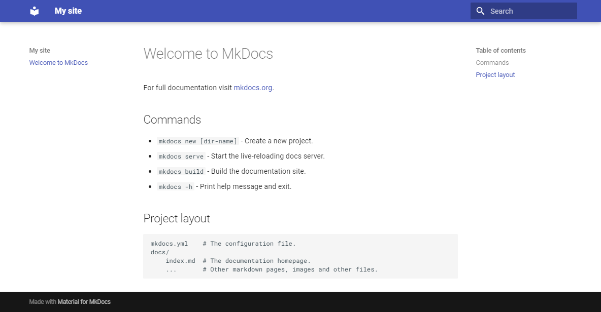

# Material for MkDocs

## 시작하기

### 설치

**with `pip`**^recommended^

```sh
$ pip install mkdocs-material
```

**with `docker`**

The official [Docker image](https://hub.docker.com/r/squidfunk/mkdocs-material/) is a great way to get up and running in a few minutes, as it comes with all dependencies pre-installed. Open up a terminal and pull the image with:

```sh
$ docker pull squidfunk/mkdocs-material
```

!!! note
    `pip` 명령어를 이용한 설치 후 사용하다가, `docker`를 사용하는 방법으로 변경하였다.
    [플러그인을 추가하는 방법](https://squidfunk.github.io/mkdocs-material/getting-started/?h=docker#with-docker)을 통해서 [awesome-pages](https://github.com/lukasgeiter/mkdocs-awesome-pages-plugin) 플러그인을 추가할 수 있도록 `Dockerfile`[^1]을 만들어서 이미지를 생성하고 사용중이다.

    Windows PowerShell에서 아래와 같이 명령해서 8080 포트로 확인이 가능하다.
    
    ```sh
    $ docker run --rm --name mkdocs -it -p 8080:8000 -v ${PWD}:/docs mkdocs-material
    ```

[^1]: `awersome-pages` 플러그인 추가한 `Dockerfile`
```title="Dockerfile"
FROM squidfunk/mkdocs-material
RUN pip install mkdocs-awesome-pages-plugin
```

## 사이트 만들기

Material for MkDocs 설치 후에 `mkdocs` 명령어를 사용하여 프로젝트 문서를 시작할 수 있다.

```
mkdocs new .
```

이 명령어를 실행하고 나면 아래와 같은 구조와 파일/폴더가 만들어진다.

```
.
├─ docs/
│  └─ index.md
└─ mkdocs.yml
```

### 설정

#### 최소한의 설정

`mkdocs.yml` 파일에 아래와 같이 최소한의 설정을 추가해 본다.

```
site_name: My site
site_url: https://mydomain.org/mysite
theme:
  name: material
```

#### 고급 설정

<div class="mdx-columns" markdown>

- [색상 변경하기]
- [글꼴 변경하기]
- [언어 변경하기]
- [로고/아이콘 변경하기]
- [Ensuring data privacy]
- [Setting up navigation]
- [Setting up site search]
- [Setting up site analytics]
- [Setting up social cards]
- [Setting up a blog]
- [Setting up tags]
- [Setting up versioning]
- [Setting up the header]
- [Setting up the footer]
- [Adding a git repository]
- [Adding a comment system]
- [Building for offline usage]
- [Building an optimized site]
- [Markdown extensions]

</div>

[색상 변경하기]: https://squidfunk.github.io/mkdocs-material/setup/changing-the-colors
[글꼴 변경하기]: https://squidfunk.github.io/mkdocs-material/setup/changing-the-fonts
[언어 변경하기]: https://squidfunk.github.io/mkdocs-material/setup/changing-the-language
[로고/아이콘 변경하기]: https://squidfunk.github.io/mkdocs-material/setup/changing-the-logo-and-icons
[Ensuring data privacy]: https://squidfunk.github.io/mkdocs-material/setup/ensuring-data-privacy
[Setting up navigation]: https://squidfunk.github.io/mkdocs-material/setup/setting-up-navigation
[Setting up site search]: https://squidfunk.github.io/mkdocs-material/setup/setting-up-site-search
[Setting up site analytics]: https://squidfunk.github.io/mkdocs-material/setup/setting-up-site-analytics
[Setting up social cards]: https://squidfunk.github.io/mkdocs-material/setup/setting-up-social-cards
[Setting up a blog]: https://squidfunk.github.io/mkdocs-material/setup/setting-up-a-blog
[Setting up tags]: https://squidfunk.github.io/mkdocs-material/setup/setting-up-tags
[Setting up versioning]: https://squidfunk.github.io/mkdocs-material/setup/setting-up-versioning
[Setting up the header]: https://squidfunk.github.io/mkdocs-material/setup/setting-up-the-header
[Setting up the footer]: https://squidfunk.github.io/mkdocs-material/setup/setting-up-the-footer
[Adding a git repository]: https://squidfunk.github.io/mkdocs-material/setup/adding-a-git-repository
[Adding a comment system]: https://squidfunk.github.io/mkdocs-material/setup/adding-a-comment-system
[Building for offline usage]: https://squidfunk.github.io/mkdocs-material/setup/building-for-offline-usage
[Building an optimized site]: https://squidfunk.github.io/mkdocs-material/setup/building-an-optimized-site
[Markdown extensions]: https://squidfunk.github.io/mkdocs-material/setup/extensions/index


### 작성한 내용 확인하기

`mkdocs.yml` 파일을 저장하고, 아래의 명령어를 실행 후 웹브라우저로 화면에 보이는 URL을 접속해 본다.

```
mkdocs serve --dirtyreload
```

웹브라우저에 아래 그림과 같이 첫 번째 화면을 확인할 수 있다.



### 문서 사이트 만들기

```
mkdocs build
```
