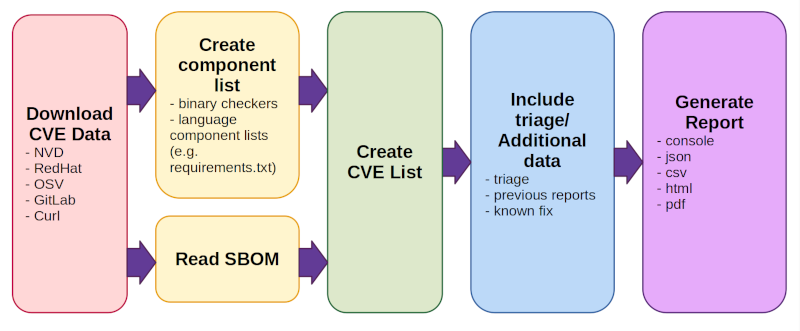

# SBOM (Software Bill of Materials)

## SBOM 개념

**SBOM(Software Bill of Materials)은 소프트웨어의 구성 컴포넌트에 관한 메타정보, 제조업 BOM으로부터 파생한 용어이지만 활용 목적에서 식품원재료표와 유사하다.**

- SBOM은 소프트웨어 구성요소 식별용 명세서로 소프트웨어 공급망 관점에서 중요하다.
  - “Software Bill of Materials” or “SBOM” means a formal record containing the details and supply chain relationships of various components used in building software. ... (2021.5, US EO14028)

- SBOM은 제조업에서 널리 사용되고 있는 자재명세서 또는 부품표(Bill Of Materials, 이하 BOM)의 개념을 소프트웨어 분야에 적용한 것

    - 제조업 BOM은 특정 제품을 구성하는 모든 부품을 목록화하여 관리함으로써 제조업체의 지속적인 양산체제 유지를 위한 공급망 관리 목적
    - 유사 개념으로 제조되어 유통되는 식품에 사용된 구성성분을 표시한 식품 원재료표(food indredients)가 있는데, 이용자의 인지 및 위험성 확인 목적
    * System BOM이 동일한 약어를 사용하여 혼동 발생 가능

- SBOM은 수혜자, 표기할 목록 범위, 외부 구성요소 관련성 등에서 제조업의 BOM, 식품원재료표 등과 차이가 있음
    - 제조업 BOM은 생산관리를 위해 주로 사용하고, 식품원재료표는 일부 구성요소만 목록에 포함한다는 점에서 SBOM과 같지 않음

    | 구분                                    | BOM                          | SBOM                                                   | 식품원재료표 (food ingredients) |
    | --------------------------------------- | ---------------------------- | ------------------------------------------------------ | ------------------------------------ |
    | 수혜자 **(주 수혜자는 굵은 글씨)** | **생산자** (부품공급자) | 생산자 (모듈공급자 포함) **구매자 (운영자 포함)** | **구매자**                           |
    | 목록 대상                               | 모든 구성요소                | 모든 구성요소                                          | 주요 구성요소                        |
    | 외부 연결                               | 없음                         | 있음 (예: API 연결)                                    | 없음                                 |

    - SBOM은 디지털 재화인 소프트웨어를 대상으로 하기 때문에 API 연결 등과 같은 외부 구성요소와의 연결이 존재하여 이들 외부 구성요소 포함 여부가 이슈라는 점에서 다른 것들과 차이가 있음

## Tools

- [CVE Binary Tool](https://cve-bin-tool.readthedocs.io/en/latest/index.html)

    - What CVE Binary Tool does when it runs:

      

        1. CVE 데이터 다운로드 (from NVD, OSV, GAD, REDHAT, Curl)
        2. 컴포넌트 목록 생성/읽기
        3. CVE 목록 생성
        4. 트리아지(Triage)/추가 데이터 포함시키기
        5. 리포트 생성

## Data Sources

[CVE Binary Tool](https://cve-bin-tool.readthedocs.io/en/latest/MANUAL.html#data-sources) 매뉴얼에 설명된 데이터 소스는 아래와 같다.

- National Vulnerability Database (NVD)
- Open Source Vulnerability Database (OSV)
- Gitlab Advisory Database (GAD)
- RedHat Security Database (REDHAT)
- Curl Database (Curl)

## 참고자료

- [SBOM 가이드](https://www.globalict.kr/sbom/sbom.do?menuCode=040600)
- [미국 SBOM(Software Bill of Materials) 정책 분석 및 시사점](https://spri.kr/posts/view/23537?code=data_all&study_type=issue_reports)
- [CVE Binary Tool](https://cve-bin-tool.readthedocs.io/en/latest/index.html)